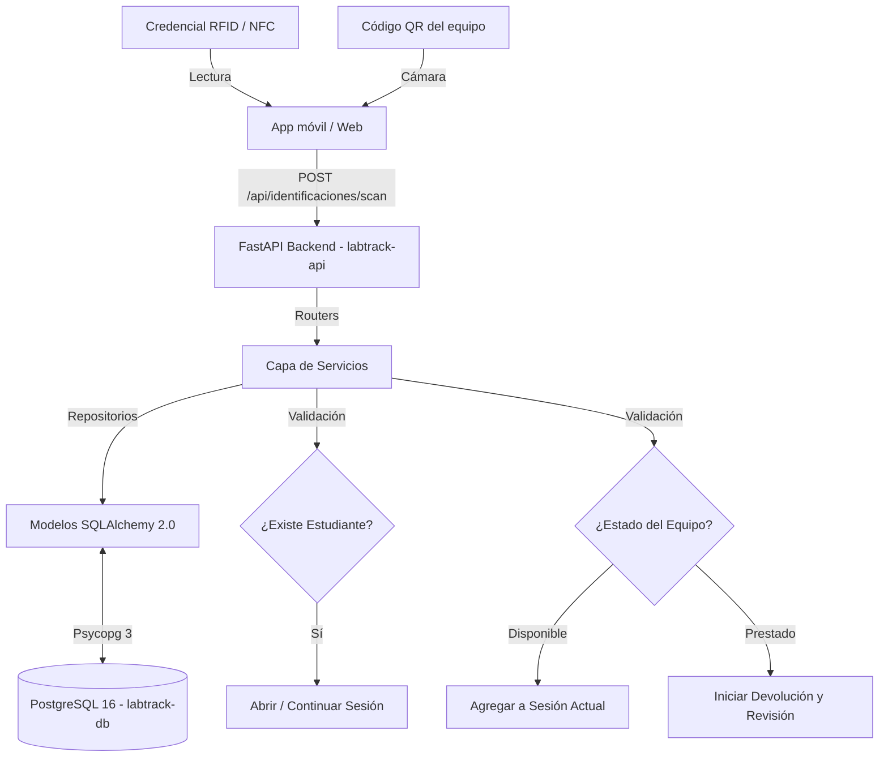

<div align="center">

# 🔬 LABTRACK

**Sistema de trazabilidad de laboratorio mediante RFID/NFC y QR**

Digitaliza el préstamo, devolución y seguimiento de equipos de laboratorio, sustituyendo el control en papel por identificación física (tarjeta RFID/NFC) y códigos QR en los equipos.

<!-- Badges de Tecnologías y Estado -->
[](https://www.python.org/)
[](https://fastapi.tiangolo.com/)
[](https://www.postgresql.org/)
[](https://www.docker.com/)
[](.github/workflows/ci.yml)
[]()

<br>

<!-- Enlaces Principales -->
[](https://labtrack-api-pvuh.onrender.com/docs)
[](https://youtu.be/_kouN0ju6p0)

</div>

---

## 📑 Tabla de contenidos

- [Descripción](#-descripción)
- [Características principales](#-características-principales)
- [Arquitectura](#️-arquitectura-y-patrones-de-diseño)
- [Stack tecnológico](#-stack-tecnológico)
- [Requisitos](#-requisitos)
- [Instalación y ejecución local](#-instalación-y-ejecución-local)
- [Configuración](#️-configuración)
- [Documentación de la API](#-documentación-de-endpoints)
- [Pruebas y calidad (CI)](#-pruebas-y-calidad-ci)
- [Despliegue](#️-despliegue)
- [Roadmap](#️-roadmap)
- [Estructura del proyecto](#-estructura-del-proyecto)
- [Equipo](#-equipo)

---

## 📖 Descripción

LABTRACK es un sistema de gestión y trazabilidad de préstamos de equipo de laboratorio mediante tecnología **RFID/NFC** y **QR**. Digitaliza el préstamo, devolución y seguimiento de equipos, integrando identificación física de estudiantes mediante tarjetas NFC/RFID y lectura de códigos QR físicos adheridos a los equipos.

El backend expone una API REST (FastAPI) que concentra toda la lógica de negocio; los clientes (interfaz web y, próximamente, app Android) solo capturan identificadores y consumen la API.

## ✨ Características principales

- **Identificación sin fricción**: credencial RFID/NFC para estudiantes + QR para equipos.
- **Ciclo de préstamo completo**: apertura de sesión, préstamo, devolución y registro de accesorios.
- **Gestión de fallas**: reporte, seguimiento y resolución de incidencias por equipo.
- **Historial global**: feed cronológico de préstamos, devoluciones y fallas, además de historial individual por estudiante y por equipo.
- **Respaldo manual**: flujo alterno por matrícula/código para cuando el hardware RFID/QR no está disponible.
- **Generación automática de QR**: cada equipo registrado genera su propio código en Base64.

## 🏗️ Arquitectura y Patrones de Diseño

El backend está construido con FastAPI y aplica estrictamente el **Patrón Repositorio** (Repository Pattern) y el **Patrón Servicio** (Service Pattern) para desacoplar el acceso a datos y las reglas de negocio de la capa de enrutamiento (Routers).

- **Validación**: modelos de Pydantic (`app/schemas/`) garantizan el contrato de la API antes de tocar la lógica del sistema.
- **ORM**: SQLAlchemy 2.0 con mapeo declarativo estricto (`Mapped`, `mapped_column`).
- **Migraciones**: Alembic gestiona el versionado del esquema de base de datos de forma incremental.
- **Frontend integrado**: la interfaz web es servida directamente por FastAPI a través de `StaticFiles`.



*(Diagrama basado en el flujo principal del MVP)*

## 🧰 Stack tecnológico

| Capa            | Tecnología                                      |
|------------------|--------------------------------------------------|
| Backend          | Python 3.12, FastAPI, SQLAlchemy 2.0, Alembic    |
| Base de datos    | PostgreSQL 16 (driver `psycopg`)                 |
| Frontend         | HTML/CSS/JS servido como `StaticFiles`           |
| Contenerización  | Docker, Docker Compose                            |
| Despliegue       | Render (IaC vía `render.yaml`)                    |
| CI/CD            | GitHub Actions (`ruff`, `mypy`, `pytest`)         |
| Cliente móvil    | Android nativo (Kotlin), NFC + cámara QR *(en desarrollo, ver [Roadmap](#️-roadmap))* |

## 📋 Requisitos

Para levantar este proyecto en un entorno local se requiere:

- Python 3.12 o superior.
- Docker y Docker Compose para la orquestación de contenedores.

## 💻 Instalación y ejecución local

1. Clona el repositorio e ingresa al directorio del proyecto:
   ```bash
   git clone https://github.com/j1390897012-maker/LABTRACK.git
   cd LABTRACK
   ```
2. Construye y levanta los contenedores con Docker Compose:
   ```bash
   docker-compose up --build
   ```
   Este comando levanta la API de FastAPI en el puerto `8000` y la base de datos PostgreSQL en el puerto `5432`.
3. Las migraciones de base de datos se ejecutan automáticamente al iniciar el contenedor de producción mediante `alembic upgrade head`.
4. La API queda disponible en `http://localhost:8000` y su documentación interactiva en `http://localhost:8000/docs`.

## ⚙️ Configuración

El sistema utiliza variables de entorno administradas localmente o inyectadas por el entorno de despliegue.

| Variable            | Descripción                                  | Valor por defecto |
|---------------------|-----------------------------------------------|--------------------|
| `POSTGRES_USER`     | Usuario de la base de datos                   | `labtrack`         |
| `POSTGRES_PASSWORD` | Contraseña de la base de datos                | `secret`           |
| `POSTGRES_DB`       | Nombre de la base de datos                    | `labtrack`         |
| `DATABASE_URL`      | Cadena de conexión (`postgresql+psycopg://`)  | construida en runtime |

## 🔌 Documentación de endpoints

La API expone las siguientes rutas, organizadas por dominio de negocio (documentación completa y detallada en [`API_CONTRACT.md`](./API_CONTRACT.md)):

| Dominio | Endpoints clave |
|---|---|
| 🎓 **Estudiantes** | `POST /api/estudiantes` · `GET /api/estudiantes` · `PUT /api/estudiantes/{id}` · `DELETE /api/estudiantes/{id}` · `GET /api/estudiantes/{id}/historial` |
| 🔬 **Equipos** | `POST /api/equipos` · `GET /api/equipos` · `POST /api/equipos/prestar` · `GET /api/equipos/{codigo}` · `PUT /api/equipos/{codigo}` · `PATCH /api/equipos/{codigo}/estado` · `PATCH /api/equipos/{codigo}/baja` · `GET /api/equipos/{codigo}/historial` |
| 📡 **Identificaciones** | `POST /api/identificaciones/scan` · `GET /api/identificaciones/ultimo-scan` · `POST /api/identificaciones/enrolar` |
| ⏱️ **Sesiones** | `GET /api/sesiones/activa` · `POST /api/sesiones` · `POST /api/sesiones/prestamo-manual` · `POST /api/sesiones/{id}/equipos` · `POST /api/sesiones/{id}/cerrar` |
| 🔄 **Devoluciones** | `POST /api/devoluciones` · `POST /api/devoluciones/accesorios` · `PATCH /api/devoluciones/{id}/falla` |
| ⚠️ **Fallas e historial** | `GET /api/fallas` · `GET /api/fallas/{id}` · `PATCH /api/fallas/{id}/resolver` · `GET /api/historial` |
| 🗂️ **Catálogos** | `GET /api/tipos-equipo` · `GET /api/tipos-accesorio` |

## 🧪 Pruebas y calidad (CI)

El aseguramiento de calidad está estandarizado mediante un pipeline de Integración Continua en GitHub Actions (`.github/workflows/ci.yml`), ejecutado automáticamente en las ramas `main`, `config/**` y `feature/**`:

- **Linting y formateo**: `ruff check .` (reglas `E`, `F`, `I`, `UP`, `B`).
- **Tipado estático**: `mypy` sobre la carpeta `app/`.
- **Pruebas unitarias y cobertura**: `pytest` + `pytest-cov`, con cobertura mínima del **80%** en la aplicación.

## ☁️ Despliegue

- **Construcción multi-etapa**: el `Dockerfile` usa un patrón *Builder* sobre `python:3.12-slim`, instalando dependencias en un entorno virtual aislado (`/opt/venv`) y descartando herramientas de build en la imagen final para reducir tamaño y superficie de vulnerabilidades.
- **Infraestructura como código**: Render administra el despliegue vía `render.yaml`, conectando el servicio web `labtrack-api` con la base de datos `labtrack-db` mediante inyección dinámica de `DATABASE_URL`.
- **Health check**: monitoreo de estado disponible en `/health`.

## 🗺️ Roadmap

En desarrollo activo (pull requests abiertos):

- 📱 **App Android nativa** — cliente móvil en Kotlin para captura de identificadores vía **NFC** (credenciales de estudiante) y **cámara QR** (equipos), consumiendo la misma API REST sin duplicar lógica de negocio.
- 🎨 **Refactor de frontend** — separación de estilos embebidos en JS hacia clases CSS reutilizables, estandarización visual del historial y corrección de manejo de respuestas `204 No Content` en `api.js`.

## 📁 Estructura del proyecto

```
LABTRACK/
├── android/              # App Android nativa (Kotlin) — NFC + QR, cliente móvil
├── app/                  # Backend FastAPI (routers, services, repositories, schemas, models)
├── alembic/              # Migraciones de base de datos
├── frontend/             # Interfaz web (HTML/CSS/JS) servida como StaticFiles
├── docs/                 # Documentación adicional del proyecto
├── tests/                # Pruebas unitarias (pytest)
├── .github/workflows/    # Pipelines de CI
├── Dockerfile
├── docker-compose.yml
├── render.yaml
├── API_CONTRACT.md       # Contrato detallado de la API
└── BACKLOG.md            # Historias de usuario y story points
```

## 👥 Equipo

Proyecto desarrollado como Reto Final del curso EDSIA 2026, por estudiantes de Ingeniería en Instrumentación Electrónica (Universidad Veracruzana).

| Integrante | Rol principal |
|---|---|
| [j1390897012-maker](https://github.com/j1390897012-maker) | Devoluciones, fallas, enrolamiento RFID, integración de hardware, app Android |
| [AlbertohdzL](https://github.com/AlbertohdzL) | Equipos, préstamo, integración de hardware, refactor de frontend |
| Alexander-multiplexor | Estudiantes, sesiones, historial |