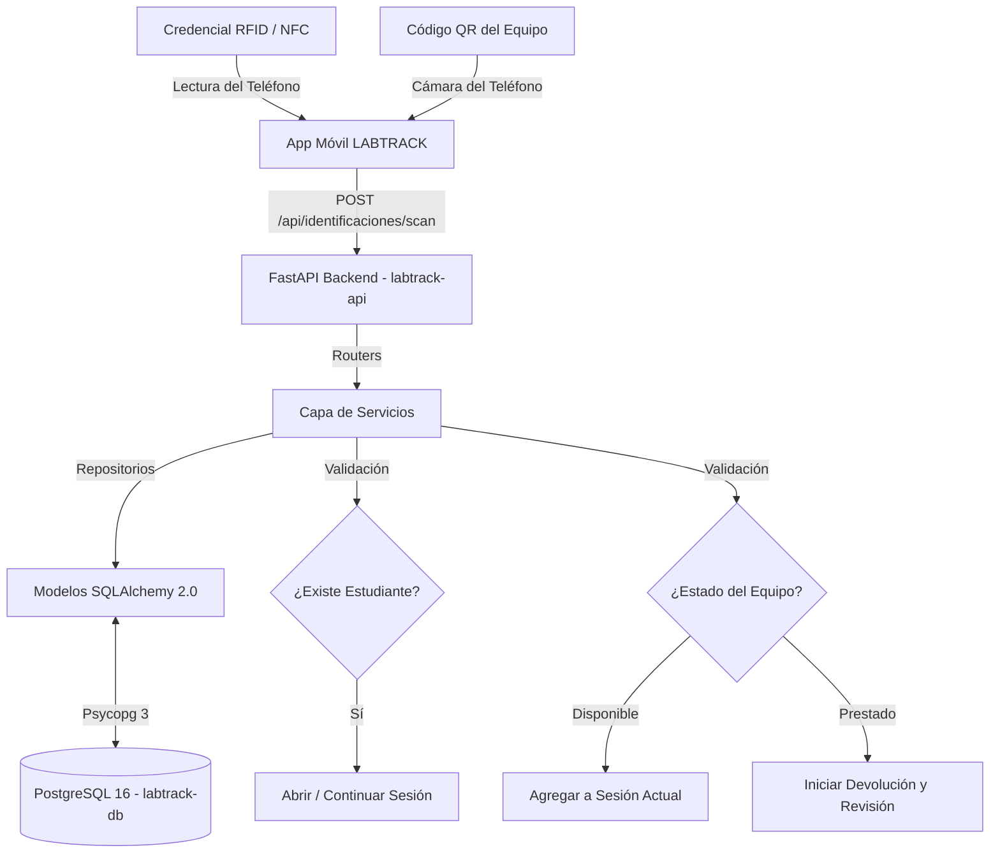

# LABTRACK: Sistema de Trazabilidad de Laboratorio

## 📖 Descripción
Sistema de gestión y trazabilidad de préstamos de equipo de laboratorio mediante tecnología RFID y QR. El sistema está diseñado para digitalizar el préstamo, devolución y seguimiento de equipos, integrando identificación física mediante tarjetas NFC/RFID para los estudiantes y lectura de códigos QR físicos generados y adheridos a los equipos a través de una aplicación móvil centralizada.

## 🚧 Estado del Proyecto
* **Fase actual:** Construcción del Producto Mínimo Viable (MVP).
* **Alcance definido:** El backlog del producto consta de 13 Historias de Usuario, sumando un total de 45 Story Points.
* **Configuración base:** Entorno de Docker, migraciones de base de datos (Alembic), flujos de Integración Continua (CI) establecidos y arquitectura de backend finalizada.

## 🚀 API en Producción
* **Infraestructura en la nube:** Desplegada utilizando la plataforma Render.
* **Servicios activos:** La infraestructura incluye el servicio web `labtrack-api` y la base de datos `labtrack-db`, configurados con inyección dinámica de la variable `DATABASE_URL` (adaptador `postgresql+psycopg`).
* **Health Check:** Monitoreo de estado configurado en la ruta genérica `/health`.

## 📋 Requisitos
Para levantar este proyecto en un entorno local, se requiere:
* Python versión 3.12 o superior.
* Docker y Docker Compose para la orquestación de contenedores.

## 💻 Instalación y Ejecución Local
1. Clona el repositorio e ingresa al directorio del proyecto.
2. Construye y levanta los contenedores con Docker Compose:
   ```bash
   docker-compose up --build

Este comando levantará la API de FastAPI en el puerto `8000` y la base de datos PostgreSQL en el puerto `5432`.
3. Las migraciones de la base de datos se ejecutarán automáticamente al iniciar el contenedor de producción mediante el comando `alembic upgrade head`.

## ⚙️ Configuración
El sistema utiliza variables de entorno administradas localmente o inyectadas por el entorno de despliegue.

- Base de datos: `POSTGRES_USER` (por defecto: `labtrack`), `POSTGRES_PASSWORD` (por defecto: `secret`), `POSTGRES_DB` (por defecto: `labtrack`).

- Cadena de conexión: La aplicación construye la conexión a través de la variable `DATABASE_URL` utilizando el formato `postgresql+psycopg://`.

## 🏗️ Arquitectura y Patrones de Diseño
El backend está contruido con FastAPI y aplica estrictamente el Patrón Repositorio (Repository Pattern) y el Patrón Servicio (Service Pattern) para desacoplar la lógica de acceso a datos y las reglas de negocio de la capa de enrutamiento (Routers).

- **Validación:** Modelos de Pydantic (`app/schemas/`) actúan como un escudo, garantizando que el contrato de la API se cumpla antes de tocar la lógica del sistema.

- **ORM:** Utiliza SQLAlchemy 2.0 con mapeo declarativo estricto (`Mapped`, `mapped_column`).

- **Migraciones:** Alembic gestiona el versionado del esquema de base de datos de manera incremental.

- **Frontend Integrado:** La interfaz gráfica es servida directamente por FastAOI a través de `StaticFiles`.



*(Diagrama basado en el flujo principal del MVP).*

## 🔌Documentación de Endpoints
La API expone las siguientes rutas categorizadas por dominio de negocio:

### 🎓 Estudiantes
- `POST /api/estudiantes`: Registra un estudiante nuevo.

- `GET /api/estudiantes`: Lista estudiantes con filtros opcionales (nombre, matrícula).

- `PUT /api/estudiantes/{id}`: Corrige errores de captura (matrícula/nombre).

- `DELETE /api/estudiantes/{id}`: Elimina un estudiante (restringido si posee historial).

- `GET /api/estudiantes/{id}/historial`: Consulta el historial completo de préstamos (US-11).

### 🔬 Equipos
- `POST /api/equipos`: Registra un equipo (autogenera QR en Base64).

- `GET /api/equipos`: Lista equipos con filtro por código, estado y tipo.

- `POST /api/equipos/prestar`: Confirma el préstamo y accesorios entregados.

- `GET /api/equipos/{codigo}`: Detalle completo de un equipo y sus préstamos activos.

- `PUT /api/equipos/{codigo}`: Actualiza el tipo de equipo (protegiendo el código físico).

- `PATCH /api/equipos/{codigo}/estado`: Cambia manualmente el estado (Disponible, En revisión).

- `PATCH /api/equipos/{codigo}/baja`: Da de baja el equipo conservando su historial.

- `GET /api/equipos/{codigo}/historial`: Historial de uso, accesorios y fallas de un equipo (US-10).

### 📡 Identificaciones y Escaneos
- `POST /api/identificaciones/scan`: Punto de entrada unificado para lecturas de la App (RFID/QR).

- `GET /api/identificaciones/ultimo-scan`: Polling para que la web lea el último escaneo global.

- `POST /api/identificaciones/enrolar`: Asocia un UID RFID a un estudiante existente (US-09).

### ⏱️ Sesiones (Flujos y Respaldos)
- `GET /api/sesiones/activa`: Consulta la sesión activa y equipos actuales de un estudiante.

- `POST /api/sesiones`: Abre una sesión manual por matrícula (Respaldo US-12).

- `POST /api/sesiones/prestamo-manual`: Registra un préstamo en un solo paso (matrícula + código) (US-12).

- `POST /api/sesiones/{id}/equipos`: Agrega un equipo manualmente a una sesión abierta.

- `POST /api/sesiones/{id}/cerrar`: Cierra la etapa de entrega de equipos.

### 🔄 Devoluciones
- `POST /api/devoluciones`: Inicia manualmente la devolución seleccionando el equipo.

- `POST /api/devoluciones/accesorios`: Confirma accesorios entregados y reporta faltantes.

- `PATCH /api/devoluciones/{id}/falla`: Finaliza la devolución registrando fallas o marcando el equipo como Disponible (US-08).

### ⚠️ Fallas e Historial Global
- `GET /api/fallas`: Lista fallas registradas y sus estados.

- `GET /api/fallas/{id}`: Detalle de una incidencia.

- `PATCH /api/fallas/{id}/resolver`: Marca una falla como resuelta y evalúa si el equipo vuelve a estar disponible.

- `GET /api/historial`: Feed cronológico global del laboratorio (Préstamos, devoluciones y fallas).

### 🗂️ Catálogos
- `GET /api/tipos-equipo`: Retorna las clasificaciones lógicas de los equipos.

- `GET /api/tipos-accesorio`: Retorna los tipos de accesorios, opcionalmente filtrados por equipo.

## 🧪 Pruebas y Calidad (CI)
El aseguramiento de calidad del código está estandarizado mediante un pipeline de Integración Continua (CI) en GitHub Actions (`.github/workflows/ci.yml`). Este flujo se ejecuta automáticamente en ramas `main`, `config/**`, y `feature/**`:

Linting y Formateo: Integración de `ruff` (con soporte para validaciones E, F, I, UP, y B) evaluando toda la base de código (`ruff check .`).

Tipado Estático: Validación estricta activada mediante `mypy` evaluando la carpeta `app/`.

Pruebas Unitarias y Cobertura: Se utiliza `pytest` junto con `pytest-cov`, exigiendo una cobertura mínima de código del 80% en el directorio de la aplicación.

## ☁️ Despliegue
La aplicación está preparada para su empaquetado y despliegue automatizado:

- **Construcción Multi-etapa:** El archivo `Dockerfile` utiliza un patrón Builder apoyado en la imagen `python:3.12-slim`. Este método instala las dependencias en un entorno virtual aislado (`/opt/venv`), descartando herramientas de construcción (como `pip` y `wheel`) en la imagen final para reducir vulnerabilidades y tamaño.

- **Infraestructura como Código (IaC):** Render administra el despliegue a través de `render.yaml`, conectando automáticamente el servicio web con la cadena de conexión de la base de datos aprovisionada.