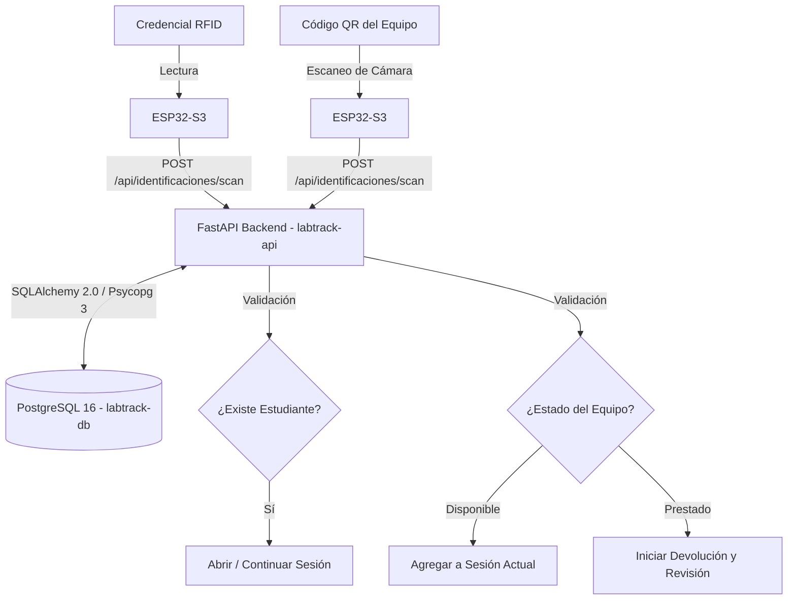

# LABTRACK: Sistema de Trazabilidad de Laboratorio

## 📖 Descripción
Sistema de gestión y trazabilidad de préstamos de equipo de laboratorio mediante tecnología RFID. El sistema está diseñado para digitalizar el préstamo, devolución y seguimiento de equipos, integrando identificación física mediante tarjetas RFID para los estudiantes y códigos QR físicos adheridos a los equipos.

## 🚧 Estado del Proyecto
* **Fase actual:** Construcción del Producto Mínimo Viable (MVP).
* **Alcance definido:** El backlog del producto consta de 13 Historias de Usuario, sumando un total de 45 Story Points.
* **Configuración base:** Entorno de Docker, migraciones de base de datos y flujos de CI/CD iniciales ya establecidos.

## 🚀 API en Producción
* **Infraestructura en la nube:** Desplegada utilizando la plataforma Render.
* **Servicios activos:** La infraestructura incluye el servicio web `labtrack-api` y la base de datos `labtrack-db`, ambos configurados bajo planes gratuitos.
* **Health Check:** Monitoreo de estado configurado en la ruta `/health`.

## 📋 Requisitos
Para levantar este proyecto en un entorno local, se requiere:
* Python versión 3.12 o superior.
* Docker y Docker Compose para la orquestación de contenedores.

## 💻 Instalación y Ejecución Local
1. Clona el repositorio e ingresa al directorio del proyecto.
2. Construye y levanta los contenedores con Docker Compose:
   ```bash
   docker-compose up --build

Este comando levantará la API de FastAPI en el puerto `8000` y la base de datos PostgreSQL en el puerto `5432`.
3. Las migraciones de la base de datos se ejecutarán automáticamente al iniciar el contenedor de producción mediante el comando alembic `upgrade head`.

## ⚙️ Configuración
El sistema utiliza variables de entorno administradas localmente o inyectadas por el entorno de despliegue.

Base de datos: `POSTGRES_USER` (por defecto: `labtrack`), `POSTGRES_PASSWORD` (por defecto: `secret`), `POSTGRES_DB` (por defecto: `labtrack`).

Cadena de conexión: La aplicación construye la conexión a través de la variable `DATABASE_URL` utilizando el formato `postgresql+psycopg://`.

## 🏗️ Arquitectura en Diagrama de Flujo


*(Diagrama basado en el flujo principal del MVP y la arquitectura de contenedores).*

## 🔌 Todos los Endpoints
La API REST centraliza toda la lógica de negocio, recibiendo las lecturas de los dispositivos físicos y gestionando el estado de la base de datos.

### Estudiantes
- `POST /api/estudiantes`: Registra un estudiante con nombre y matrícula.

- `GET /api/estudiantes/{id}`: Consulta los datos de un estudiante.

- `GET /api/estudiantes/{id}/historial`: Consulta el historial de préstamos del estudiante.

- `GET /api/estudiantes/{id}/actuales`: Consulta los equipos que tiene actualmente en préstamo.

### Equipos
- `POST /api/equipos`: Registra un equipo nuevo con código y tipo.

- `GET /api/equipos`: Lista equipos con filtro opcional por estado.

- `GET /api/equipos/{codigo}`: Consulta la ficha técnica, estado, fallas e historial de un equipo.

- `PATCH /api/equipos/{codigo}/estado`: Cambia manualmente el estado de un equipo (`Disponible`, `Prestado`, `En revisión`).

### Identificación Física y Enrolamiento
- `POST /api/identificaciones/scan`: Recibe una lectura (RFID o QR) desde el ESP32-S3 y determina el flujo a seguir (abrir sesión, agregar equipo, iniciar devolución).

- `POST /api/identificaciones/enrolar`: Asocia un nuevo UID de tarjeta RFID a un estudiante previamente registrado.

### Sesiones de Préstamo
- `POST /api/sesiones`: Abre manualmente una sesión para un estudiante.

- `GET /api/sesiones/activas`: Consulta la sesión activa de un estudiante mediante su ID.

- `POST /api/sesiones/{id}/equipos`: Agrega manualmente un equipo a una sesión abierta.

- `PUT /api/sesiones/{id}/equipos/{equipo_id}/accesorios`: Registra los accesorios incluidos con un equipo prestado.

- `POST /api/sesiones/{id}/cerrar`: Finaliza la etapa de entrega marcando los equipos como prestados.

### Devoluciones y Fallas
- `POST /api/devoluciones`: Inicia el flujo de devolución de un equipo.

- `PATCH /api/devoluciones/{id}/accesorios`: Registra los accesorios entregados y reporta los faltantes.

- `PATCH /api/devoluciones/{id}/falla`: Registra una falla detectada al devolver el equipo, pasándolo a estado "En revisión".

- `POST /api/devoluciones/{id}/cerrar`: Finaliza la devolución y actualiza el estado general del equipo.

- `PATCH /api/fallas/{id}`: Marca una falla histórica como resuelta.

## 🧪 Pruebas y Calidad
El aseguramiento de calidad del código está estandarizado mediante las siguientes herramientas:

- Pruebas Unitarias y Cobertura: Se utiliza `pytest` junto con `pytest-cov`, exigiendo una cobertura mínima de código del 80% (`--cov-fail-under=80`) en el directorio `app`.

Linting y Formateo: Integración de `ruff` (con soporte para validaciones `E`, `F`, `I`, `UP`, y `B`) definiendo una longitud de línea máxima de 88 caracteres.

Tipado Estático: Validación estricta activada mediante `mypy` para la versión de Python 3.12 (`strict = true`).

## ☁️ Despliegue
La aplicación está preparada para su empaquetado y despliegue automatizado:

- **Construcción Multi-etapa:** El archivo `Dockerfile` utiliza un patrón Builder apoyado en la imagen `python:3.12-slim`. Este método instala las dependencias en un entorno virtual aislado (`/opt/venv`), descartando herramientas de construcción (como `pip` y `wheel`) en la imagen final para reducir vulnerabilidades y tamaño.

- **Actualización de Seguridad O.S.:** Las actualizaciones de paquetes de Debian (`apt-get update && apt-get upgrade`) se ejecutan tanto en la etapa de construcción como de producción para mitigar avisos de herramientas de escaneo como Trivy.

- **Infraestructura como Código (IaC):** Render administra el despliegue a través de `render.yaml`, conectando automáticamente el servicio web con la cadena de conexión de la base de datos aprovisionada.